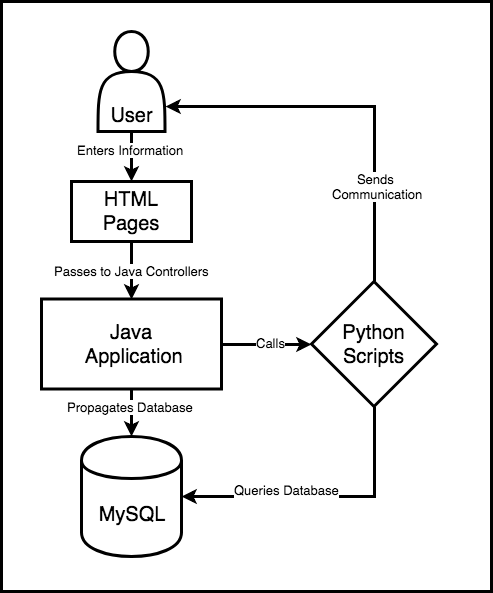

# Python Functions
This directory contains the Python functions needed to send emails to customers via SMTP. Emails are of two varieties, each with different logic, but relying on the same communication protocol:

1. Receipt: Sends an email to the user associated with their orderID containing an order item detail, including options, prices, and shipping information.
1. Newsletter: Sends a welcome email to the user containing a newsletter with the current month's birthstone.

## Overview
Customer communication is handled by the Java Application, specifically the [main controller](SpringMVCAnnotationOnlineStore/src/main/java/org/o7planning/springmvconlinestore/controller/MainController.java). When an order is generated by a customer the database is populated, and this information is retrieved directly by the python application through [MySQL-connector-python](https://dev.mysql.com/downloads/connector/python/). Communication is passed to the customer via Python's built-in in primitive: `smtplib` from our business gmail account. 



## Dependencies:
1. Python 3.6
1. [MySQL-connector-python](https://dev.mysql.com/downloads/connector/python/): `python3 -m pip install MySQL-connector-python`.

## Running as a Standalone Application:
1. Make sure that MySQL is set up. More information can be found in the [DEVELOPER READEME](../DEVELOPER.md).
1. For a Receipt, run: `python3 SendReceipt.py [OrderID]`
1. For a Newsletter:
    1. Call `Newsletter.py` and give it three parameters: `EmailAddress`, `FirstName`, `LastName`:
    1. Ex. `python3 Newsletter.py [EmailAddress] [FirstName] [LastName]`

## Running from the Web Application:
1. Both `SendReceipt.py` and `Newsletter.py` are called from the [main controller](SpringMVCAnnotationOnlineStore/src/main/java/org/o7planning/springmvconlinestore/controller/MainController.java).
1. For example, the Newsletter is passed is passed as a standalone application to the `ProcessBuilder`:

```java
@RequestMapping(value = { "/newsLetter" }, method = RequestMethod.POST)
public String newsLetter(Model model, HttpServletRequest request, @ModelAttribute("signUpForm") CustomerInfo userInfo, //
    @RequestParam(value = "firstName") String firstName,
    @RequestParam(value = "lastName") String lastName, //
    @RequestParam(value = "email") String email,
        BindingResult result, //
        final RedirectAttributes redirectAttributes) {


        if (result.hasErrors()) {
            return "index";
        }
        try {
            String dir = System.getProperty("user.home");
            List<String> commands = new ArrayList<String>();
            commands.add("/Users/macowner/anaconda3/bin/python3"); // command
            //commands.add("-l");
            commands.add("/Users/macowner/eclipse-workspace/CIS556_Project/pythonFunctions/Newsletter.py");
            commands.add(email);
            commands.add(firstName);
            commands.add(lastName);
            // creating the process
            ProcessBuilder pb = new ProcessBuilder(commands);

            // startinf the process
            Process process = pb.start();

            // for reading the ouput from stream
            BufferedReader bfr = new BufferedReader(new InputStreamReader(process.getInputStream()));

            System.out.println(".........start   process.........");  
            String line = "";     
            while ((line = bfr.readLine()) != null){
                System.out.println("Python Output: " + line);
            }

            System.out.println("........end   process.......");
        }
            catch(Exception e){System.out.println(e);}


    return "redirect:/";
}
```
